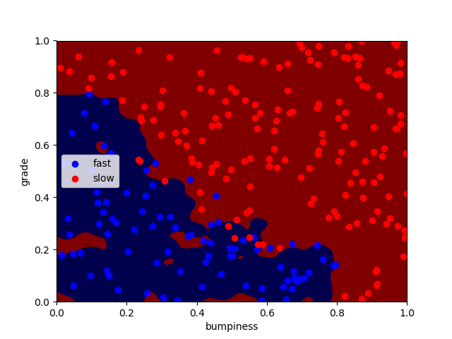

## 支持向量机
### 1. 学习笔记
#### 1.1 重要参数
| 参数 | 说明 |
| -| -|
| C|C-SVC的惩罚参数C?默认值是1.0。<br> C越大，相当于惩罚松弛变量，希望松弛变量接近0，即对误分类的惩罚增大，趋向于对训练集全分对的情况，这样对训练集测试时准确率很高，但泛化能力弱。C值小，对误分类的惩罚减小，允许容错，将他们当成噪声点，泛化能力较强。|
| kernel | 核函数，默认是rbf，可以是‘linear’, ‘poly’, ‘rbf’, ‘sigmoid’, ‘precomputed’ |
| gamma|‘rbf’,‘poly’ 和‘sigmoid’的核函数参数。默认是’auto’，则会选择1/n_features |

#### 1.2 调整参数
例如`C`参数，就是`0.1,1,100,1000`依次计算。

### 2. 结果展示

### 3. 我的代码部分
```python
# File: main.py
import sys
import matplotlib.pyplot as plt
import copy
import numpy as np
import pylab as pl
try:
    from class_vis import prettyPicture
    from prep_terrain_data import makeTerrainData
except Exception as error:
    from .class_vis import prettyPicture
    from .prep_terrain_data import makeTerrainData

features_train, labels_train, features_test, labels_test = makeTerrainData()

from sklearn.svm import SVC
clf = SVC(kernel="rbf",gamma=1000)
# clf = SVC(kernel='rbf')
clf.fit(features_train,labels_train)

from sklearn.metrics import accuracy_score
pred = clf.predict(features_test)
right_rate = accuracy_score(y_pred=pred,y_true=labels_test)

print("The right rate is %.4f" % right_rate)
prettyPicture(clf, features_test, labels_test)

```