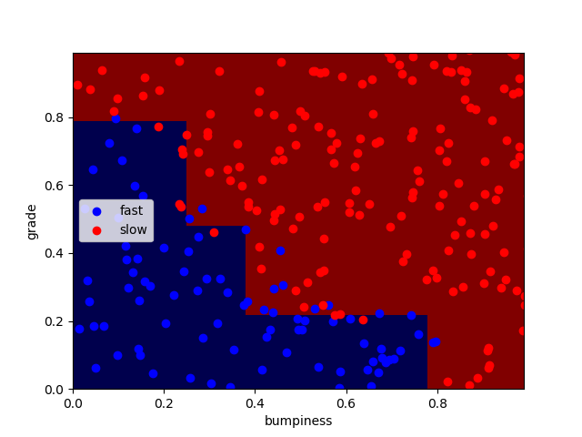

## 决策树

### 1. 参数学习
#### 1.1 重要参数
| 参数 | 说明 |
| - | - |
| min_samples_split | 区分一个内部节点需要的最少的样本数。默认为2.**可以为float，代表百分比** |
| criterion | 衡量分类的质量。支持的标准有"gini"代表的是Gini impurity(不纯度)与"entropy"代表的是information gain（信息增益）。|
| max_depth | 默认为"None".表示树的最大深度。如果是"None",则节点会一直扩展直到所有的叶子都是纯的或者所有的叶子节点都包含少于min_samples_split个样本点。**如果特征量很大的话，常用的可以取值10-100之间** |
| max_features | 默认为None。|

#### 1.2 针对max_features
1. 如果是int，在每次分类是都要考虑max_features个特征。
2. 如果是float,那么max_features是一个百分率并且分类时需要考虑的特征数是int(max_features*n_features,其中n_features是训练完成时发特征数)。
3. 如果是auto,max_features=sqrt(n_features)
4. 如果是sqrt,max_features=sqrt(n_features)
5. 如果是log2,max_features=log2(n_features)
6. 如果是None，max_features=n_features

#### 1.3 更多
[中文文档](http://blog.csdn.net/li980828298/article/details/51172744)

[官方文档](http://scikit-learn.org/dev/modules/generated/sklearn.tree.DecisionTreeClassifier.html#sklearn.tree.DecisionTreeClassifier)

### 2. 结果展示


### 3. 代码部分
```python
def classify(features_train, labels_train):
    ### your code goes here--should return a trained decision tree classifer
    # print(len(features_train),len(labels_train))
    clf = DecisionTreeClassifier(criterion="entropy",min_samples_split=50).fit(features_train,labels_train)
    return clf
```